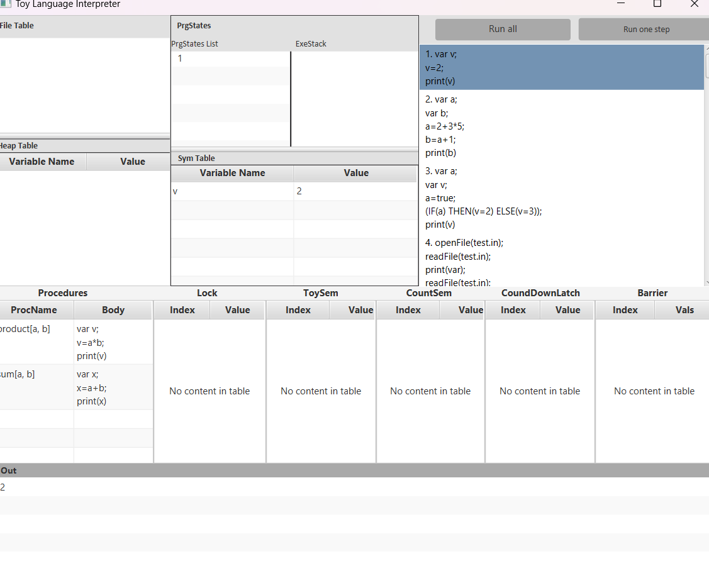
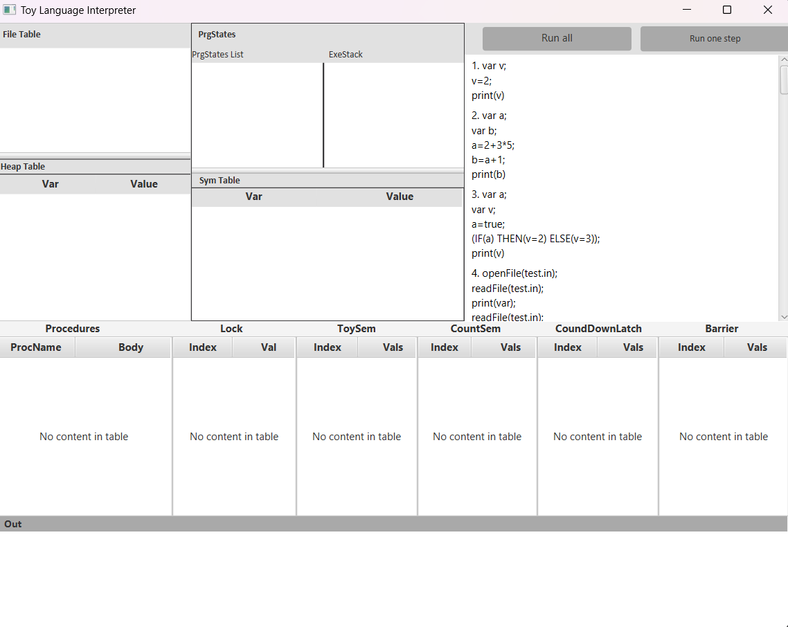

# ToyLanguageInterpreter
This project implements features commonly found in C-like languages, such as barriers, semaphores, and threads. It provides a toy language interpreter built using Java and JavaFX, with various statement classes representing different operations. These include synchronization primitives like locks, barriers, latches, and semaphores, allowing for concurrent programming constructs. The project leverages Java's concurrency utilities and custom data structures to manage these features effectively.

## Project Structure
ToyLanguage/ 
├── src/ 
│   ├── main/ 
│   │   ├── java 
│   │   │   ├── com/ 
│   │   │   │   ├── example/ 
│   │   │   │   │   ├── trial/ 
│   │   │   │   │   │   ├── HelloApplication.java 
│   │   ├── resources/ 
│   │   │   ├── com/ 
│   │   │   │   ├── example/ 
│   │   │   │   │   ├── trial/ 
│   │   │   │   │   │   ├── hello-view.fxml 
├── pom.xml 

## GUI
 
 
